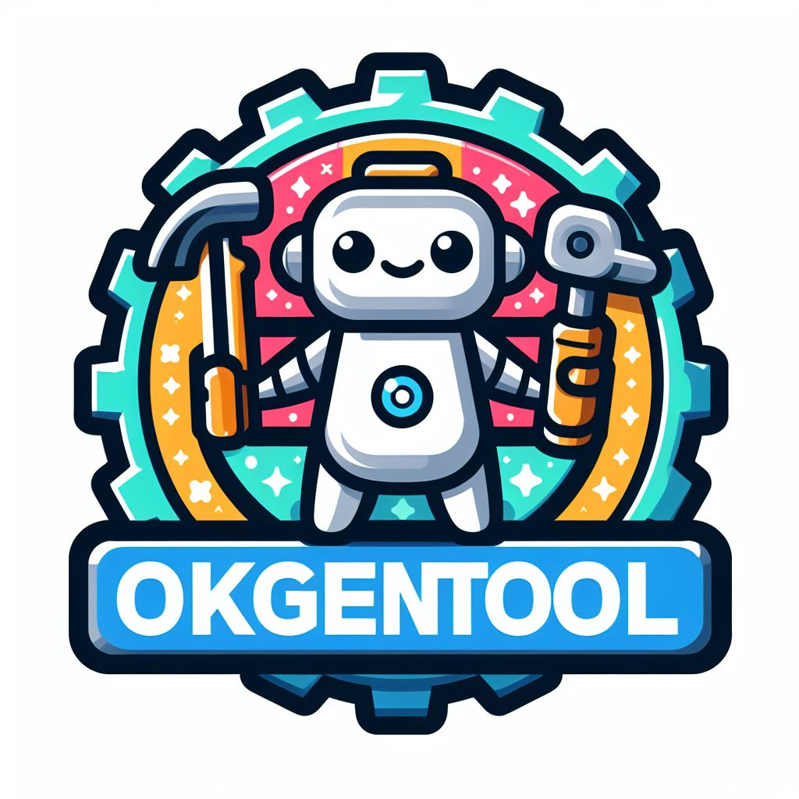

# OKGenTool - OpenAPI Ktor Generation Tool


## Introduction
**Tool for the generation of client and server code based on OpenAPI**

The goal of this project is the creation of a tool for the generation of both client and server code based on OpenAPI definitions for HTTP APIs, aimed for use with Ktor.
Given an OpenAPI definition, this tool should be able to generate artifacts to help with the development of Ktor-based clients and servers.

> [!NOTE]
This is a final project of the **Computer Science and Computer Engineering BSc** from [Lisbon School of Engineering (ISEL)](http://isel.pt), under the **Project and Seminar** course unit, 2023/24 Summer Semester.

## Students/Developers Contacts

| Name        | Number | Contact     |
| ----------- | ------ | ----------- |
| Hélio Fitas | 39622  | A39622@alunos.isel.pt; heliofitas@gmail.com; [Linkedin](https://www.linkedin.com/in/heliofitas/)
| Dinis Laranjeira | 46081 | A46081@alunos.isel.pt; dinis.laranjeira14874@gmail.com |

**Supervisor:** Pedro Félix - ISEL


# How to use OkGenTool
A demo is available in this repository, in the folder [demo](./demo/)

> [!IMPORTANT]
> This section is under construction

# System Architecture


# Third-Party Libraries
**OKGenTool** uses some third-party libraries. They are:
| Library | Repository | License |
|---------|------------|---------|
| swagger-parser | https://github.com/swagger-api/swagger-parser | Apache-2.0 license
| kotlinpoet | https://github.com/square/kotlinpoet | Apache-2.0 license

# Gradle Configuration
**OKGenTool** was designed to be used as a command line interface.  
However, gradle can be configured to help you run **OKGenTool** and regenerate the code when needed, for example when the OAD yaml file gets an update.  
In your project's `build.gradle(.kts)` file, add a custom task that runs **OKGenTool**:
```Gradle
tasks.register("runOKGenTool", Exec::class) {
    commandLine("java", "-jar", "C:\\path\\to\\okgentool.jar",
        "-s", "C:\\path\\to\\petstore.yaml",
        "-ts","C:\\path\\to\\your\\project\\server\\src\\main\\kotlin",
        "-p", "your.base.package.name")
}
```

The parameters are the same when using the command line:
- `-s <sourcePath>` is the path for the OAD file
- `-ts <targetPath>` is the target folder where the files will be generated
- `-p <package>` (optional) is the base package name of your project.

>[!TIP]
  Use absolute paths only. Relative paths are in the roadmap here: https://github.com/OKGenTool/okgentool/issues/46


Now, every time you need to regenerate files, just execute:
```
./gradlew runOKGenTool
```

Additionally, if you want to regenerate the files every time you build your application, you can customize task dependencies to make it run before the build task. Add the following to your `build.gradle(.kts)` file:
```
tasks.named("build") {
    dependsOn(tasks.named("runOKGenTool"))
}
```


# Unsupported Features
**OKGenTool** dos not supports some features yet, such as:
1. Inline responses of type `object`. Inline responses are responses that requires a content that is not a reusable `schema` defined in the `components` section of the OAD file. Example:
    ```
    responses:
        '200':
            description: successful operation
            content:
                application/json:
                schema:
                    type: object
                    additionalProperties:
                        type: integer
                        format: int32
    ```
1. `additionalProperties` are not supported even when used in a reusable schema.
