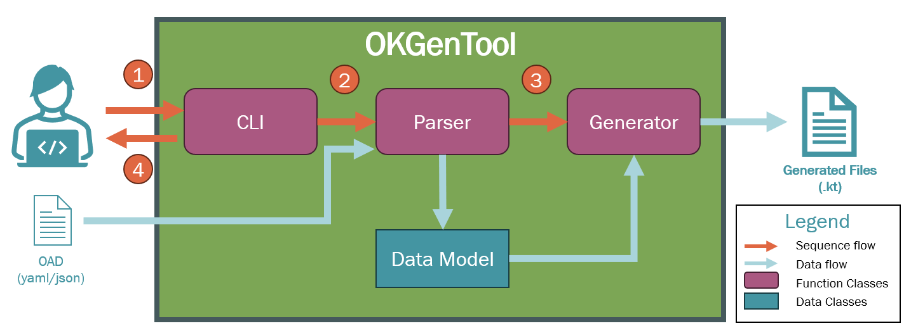

# OKGenTool - OpenAPI Ktor Generation Tool

## Introduction
**Tool for the generation of client and server code based on OpenAPI**

The goal of this project is the creation of a tool for the generation of both client and server code based on OpenAPI definitions for HTTP APIs, aimed for use with Ktor.
Given an OpenAPI definition, this tool should be able to generate artifacts to help with the development of Ktor-based clients and servers.

> [!NOTE]
This is a final project of the **Computer Science and Computer Engineering BSc** from [Lisbon School of Engineering (ISEL)](http://isel.pt), under the **Project and Seminar** course unit, 2023/24 Summer Semester.

## Students/Developers Contacts

| Name        | Number | Contact     |
| ----------- | ------ | ----------- |
| Hélio Fitas | 39622  | A39622@alunos.isel.pt; heliofitas@gmail.com; [Linkedin](https://www.linkedin.com/in/heliofitas/); [Slack](https://i-on-workspace.slack.com/team/U06N9C4V75W)
| Dinis Laranjeira | 46081 | A46081@alunos.isel.pt; dinis.laranjeira14874@gmail.com |

# How to use OKGenTool
> [!IMPORTANT]
> This section is under construction

# Block Diagram

# Third-Party Libraries
**OKGenTool** uses some third-party libraries. They are:
| Library | Repository | License |
|---------|------------|---------|
| swagger-parser | https://github.com/swagger-api/swagger-parser | Apache-2.0 license
| kotlinpoet | https://github.com/square/kotlinpoet | Apache-2.0 license
