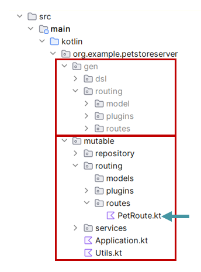

# Pet Store Server Demo

This demo demonstrates the main features of **OKGenTool**.  
It's using a widely known OpenAPI Description (OAD), **[Pet Store](https://github.com/swagger-api/swagger-petstore/blob/master/src/main/resources/openapi.yaml)**, that contains several operations that a common API usually supports.
Bellow are the steps to setup and run the project **PetStoreServer** using **OKGenTool**.

### Before you begin
Before you begin, note that this demo takes in consideration some assumptions, and it's important to validate them before running the demo, to ensure that everything runs as expected. If these assumptions are not verified, a developer who wants to run the demo should make the necessary adjustments by it's own.  
The assumptions are:
- The demo is running on a Windows system
- IntelliJ is previously installed with kotlin compiler
- [`curl`](https://curl.se/) is installed on the running system 


## 1. Setup and generate code
1. Download this [demo](DownloadDemo.zip) to a local folder on your computer. Example: `C:\ISEL\PS\okgentool\demo`  
1. Open a command line window in the same folder
1. Run the following command:
    ```
    java -jar okgentool.jar -s "C:\ISEL\PS\okgentool\demo\petstore.yaml" -ts "C:\ISEL\PS\okgentool\demo\PetStore\server\src\main\kotlin" -p "org.example.petstoreserver"
    ```
    Parameters:
    - `-s <sourcePath>` is the path for the OAD file
    - `-ts <targetPath>` is the target folder where the files will be generated
    - `-p <package>` (optional) is the base package name of your project.

>[!TIP]
 Adapt the path to your local system.  
 Use absolute paths only. Relative paths are in the roadmap here: https://github.com/OKGenTool/okgentool/issues/46
    

4. Open the PetStore folder with an IDE (IntelliJ recommended)  
>[!NOTE]
If IDE was previously opened, you may need to reopen it to reload the indexes, of the generated files.  
If the mutable code could not access the generatede code, and reopening the IDE does not solves the problem, the IDE needs to be repaired. In IntelliJ use this option:  `File -> Repair IDE`

## 2. Observations
After opening the IDE you will notice, that at main package level (`org.example.petstoreserver`), there are two packages to distinguish the mutable code from the generated code: `mutable` and `gen`.  
The package `gen` is grayed because is being ignored by git.  


The **mutable** code is the code for which the developer is responsible, and it is the only code that should be manually edited. On the other hand, the **generated code** should never be edited manually, as doing so may result in the loss of code if the generated code is regenerated.

This demo will guide you in implementing an HTTP API server by developing on the mutable code, that was previously created. It following a typical HTTP API server architecture with three main components: `routing`, `services`, and `repository`.

The starting point of our demo is the file `PetRoute.kt`.

## 3. Run the server
Run the server (function `main()` in file `Application.kt`).  
At this point you should have an error-free running server. However, the server is not handling requests yet.  
In the next chapter you will implement some operations.

## 4. Implement API Operations using the OKGenTool DSL
To implement the API Operations, edit the file `PetRoute.kt` in the package `routing.routes` of the mutable code.  
This file has a variable `petServices` built previously for demo purposes, and it's intent is to simulate a **Services** module of a typical HTTP API server. This piece of code is mutable and of responsibility of the developer.

In this file, we will add an extension function `petDSLRouting` to the `OkGenDsl` generated class:
```kotlin
val petServices = PetServices()

// Use this function to write the demo
fun OkGenDsl.petDSLRouting() {
    //...
}
```

### 4.1. Add Pet
Let's implement the **Add Pet** operation.  
Inside the `petDSLRouting()`, when writing `route.` IDE will suggest the available operations. Choose `addPet`.

```kotlin
fun OkGenDsl.petDSLRouting() {
    route.addPet {
    }
}
```
Now we need to define the function that we need to pass to `addPet`. At this level we have available an object `request` that has properties passed in the HTTP request, either in the body, the query string or in the path. In this operation the property available is `pet`. Let's get the pet from the request and pass it to our internal services to add it to the database.
```kotlin
fun OkGenDsl.petDSLRouting() {
    route.addPet {
        val pet = request.pet
        val newPet = petServices.addPet(pet)
        //IDE may warn about pet type mismath. Well handle that next.
    }
}
```

We also need to implement appropriate responses.  
Other object available in all operations is the `response`. This object has all the responses defined in the OAD for this operation. In this case, we have two available responses:
- `addPetResponse200` - Successful operation
- `addPetResponse405` - Invalid input

>[!TIP]
It's recommended that you consult the OAD file, to get better context of the operation and to choose the best response from the ones defined in the description file.

Despite we only have one failure response available, it seems that a failure could occur in two situations
1. When the deserialization of the object fails. In that case the `pet` should be `null`
2. If the object contains an `id`. Makes sense that the pet `id` should only be assigned after adding it to the database  

With that in mind, lets make some validations and end the operation with the respective responses:

```kotlin
fun OkGenDsl.petDSLRouting() {
    route.addPet {
        val pet = request.pet
        if (pet == null || pet.id != null) {
            response.addPetResponse405() // Invalid input
            return@addPet
        }
        val newPet = petServices.addPet(pet)
        response.addPetResponse200(newPet) // Successful operation
    }
}
```
And the first operation is implemented!

### 4.2. Get Pet by ID
Next we will implement the operation **Get Pet by ID**, choosing `route.getPetId{..}`.  
Like in the previous operation, the `request` object contains the property used in the HTTP request. In this case the property is `petId`.
Like before, we should add the property in a local variable and use it to get the information from the internal services. Here is how the final code should look like:

```kotlin
fun OkGenDsl.petDSLRouting() {    
    //...
    route.getPetById {
        val petId = request.petId ?: run {
            response.getPetByIdResponse400() // Invalid ID supplied
            return@getPetById
        }

        val pet = petServices.getPet(petId)
        if (pet != null)
            response.getPetByIdResponse200(pet) // Successful operation
        else
            response.getPetByIdResponse404() // Pet not found
    }
}
```

For this operation, the OAD defines the following responses with the respective descriptions:
- `getPetByIdResponse200` - Successful operation
- `getPetByIdResponse400` - Invalid ID supplied
- `getPetByIdResponse404` - Pet not found


### 4.3. Update Pet
To implement the **Update Pet** operation, we need to read the `pet` from the `request`, update the database, and end with one of four possible responses:
1. `updatePetResponse200` - Successful operation
2. `updatePetResponse400` - Invalid ID supplied
3. `updatePetResponse404` - Pet not found
4. `updatePetResponse405` - Invalid ID supplied

The code to implement **Update Pet**, should be the following:

```kotlin
fun OkGenDsl.petDSLRouting() { 
    //...
    route.updatePet {
        val pet = request.pet ?: run {
            response.updatePetResponse405() //Validation exception
            return@updatePet
        }

        if (pet.id == null) {
            response.updatePetResponse400() // Invalid ID supplied
            return@updatePet
        }

        when (val foundPet = petServices.updatePet(pet)) {
            null -> response.updatePetResponse404() // Pet not found
            else -> response.updatePetResponse200(foundPet) // Successful operation
        }
    }
}
```

Now we have implemented three main operations of the Pet Store API: **Add Pet**, **Get Pet by ID** and **Update Pet**.
In the next chapter we will test if our implementation was successfully.

## 5. Test the server
Run the server and let's test the implemented operations.

### 5.1 Add Pet
Accordingly to the OAD, the operation **Add Pet** consist in making a `POST` request to the path `/pet` passing an object in `json` or `xml` format with two required properties: `name` and `photoUrls`.  
Using curl, the command should look like this:

```
curl -i -X POST http://127.0.0.1:8080/pet -H "Content-Type: application/json" -d "{\"name\": \"boby\", \"photoUrls\": [\"photoUrls\"]}"

```
#### Success Messages
If everything worked as expected, this should be the result:
```
HTTP/1.1 200 Successful operation
Content-Length: 90
Content-Type: application/json

{"id":5,"name":"boby","category":null,"photoUrls":["photoUrls"],"tags":null,"status":null}
```

#### Failure Messages
If the object could not be deserialized due to incorrect format, or the request is providing an `id`, the output will be:
```
HTTP/1.1 405 Invalid input
Content-Length: 0
```

### 5.2 Get Pet by ID
The operation to get a pet providing a pet `id`, is realized through making a `GET` request to the path `/pet/{petId}`.

```
curl -i http://127.0.0.1:8080/pet/1 
```

#### Success Messages
Expected result if the pet is found:
```
HTTP/1.1 200 successful operation
Content-Length: 115
Content-Type: application/json

{"id":1,"name":"Max","category":{"id":1,"name":"Dogs"},"photoUrls":["url photos"],"tags":null,"status":"available"}
```

#### Failure Messages
Expected result if the pet is not found:
```
HTTP/1.1 404 Pet not found
Content-Length: 0
```

Expected result if it was passed an invalid `petId` in the path parameter (example `/pet/xxx`):
```
HTTP/1.1 400 Invalid ID supplied
Content-Length: 0
```


### 5.3 Update Pet
Update a pet is achieved by making a `PUT` HTTP request to the path `/pet` with an object in
`json` or `xml` format. Let's try to change the `status` of pet named `Max` to `sold`.

```
curl -i -X PUT http://127.0.0.1:8080/pet -H "Content-Type: application/json" -d "{\"id\": 1, \"name\": \"Max\", \"category\": {\"id\": 1, \"name\": \"Dogs\"}, \"photoUrls\": [\"photoUrls\"], \"tags\": null, \"status\": \"sold\"}"
```

#### Success Messages
If the operation is successfully:
```
HTTP/1.1 200 Successful operation
Content-Length: 109
Content-Type: application/json

{"id":1,"name":"Max","category":{"id":1,"name":"Dogs"},"photoUrls":["photoUrls"],"tags":null,"status":"sold"}
```

#### Failure Messages
If the pet is not found:
```
HTTP/1.1 404 Pet not found
Content-Length: 0
```

If the `id` is not provided:
```
HTTP/1.1 400 Invalid ID supplied
Content-Length: 0
```

If the object could no be deserialized or does not pass other validations (example: the request is using an invalid `status`), the response will be:
```
HTTP/1.1 405 Validation exception
Content-Length: 0
```
